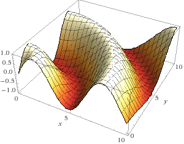

# STAN Toy Problem

## Hierarchical Gaussian Process Fitting and Posterior Realization in 2D

  

### Problem Setup

1.    Pick 100 (x, y) input points in the above space from a uniform distribution.
2.    Compute associated z-values (responses) via: z = sin(sqrt(x^2 + y^2)).
3.    Pick 20 random (x,y) inputs and try to infer associated response by modeling known and unknown responses jointly as a gaussian process in STAN.
4.    2 hyperparameters: x and y length scales (left floating).