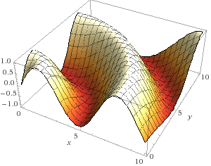
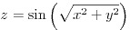

## STAN Runtime Test: Hierarchical Gaussian Process Hyperparameter
   Fitting and Posterior Realization in 2D

  

### Problem Setup

1.    Pick 100 inputs (xy points) in the above space from a uniform distribution.
2.    Compute associated responses via:  

3.    Pick 20 new inputs from uniform distribution in above space.
4.    Try to infer associated responses by modeling responses as a gaussian process in STAN.
5.    2 hyperparameters: x and y length scales (left floating).

### Four Different Implementations

1.    `JOINT`: Standard implementation (STAN manual pp. 129-130. -- (`y ~ multi_normal(mu, Sigma)`). Expected to be slowest. 
2.    `JOINT_CHOLESKY`: Standard implementation with "cholesky speedup." (STAN manual p. 135 -- `y ~ multi_normal_cholesky(mu, cholesky_decompose(Sigma))`). Expected to finish 3rd or 2nd.
3.    `ANALYTIC`: Derive posterior preditive distribution for unknown responses analytically. (STAN manual pp. 136-7 -- `y2 ~ multi_normal(K_transpose_div_Sigma * y1, Omega - K_transpose_div_Sigma * K)`). Expected to finish 2nd or 2rd. 
4.    `ANALYTIC_CHOLESKY`: Derive posterior predictive distribution for unknonwn responses analytically, with "cholesky speedup." (STAN Manual p. 137 -- `y2 ~ multi_normal_cholesky(K_transpose_div_Sigma * y1, cholesky_decompose(Omega - K_transpose_div_Sigma * K))`). Expected to finish 1st.

### This Repository

Models live in folders named by implmementation type. Python wrappers used to produce each result are provided in each folder, along with STAN logs.

### Results

All results computed using `pystan` on edison at NERSC. Each
implementation was run with 4 chains and 2000 iterations per chain
(1000 warmup, 1000 sampling).

<table border="2" cellspacing="0" cellpadding="6" rules="groups" frame="hsides">

<colgroup>
<col  class="left" />

<col  class="left" />

<col  class="left" />

<col  class="right" />

<col  class="left" />
</colgroup>
<thead>
<tr>
<th scope="col" class="left">IMPLEMENTATION</th>
<th scope="col" class="left">EXPECTATION</th>
<th scope="col" class="left">RESULT</th>
<th scope="col" class="right">ITER REACHED (CHAIN-MEAN)</th>
<th scope="col" class="left">TERMINATED?</th>
</tr>
</thead>
<tbody>
<tr>
<td class="left">`JOINT`</td>
<td class="left">FINISH 4TH</td>
<td class="left">FINISHED 1ST</td>
<td class="right">2000</td>
<td class="left">Y (27 min)</td>
</tr>

<tr>
<td class="left">`JOINT CHOLESKY`</td>
<td class="left">FINISH 3RD</td>
<td class="left">FINISHED 2ND</td>
<td class="right">550</td>
<td class="left">N</td>
</tr>

<tr>
<td class="left">`ANALYTIC`</td>
<td class="left">FINISH 2ND</td>
<td class="left">FINISHED 3RD</td>
<td class="right">150</td>
<td class="left">N</td>
</tr>

<tr>
<td class="left">`ANALYTIC CHOLESKY`</td>
<td class="left">FINISH 1ST</td>
<td class="left">FINISHED 4TH</td>
<td class="right">38</td>
<td class="left">N</td>
</tr>
</tbody>
</table>